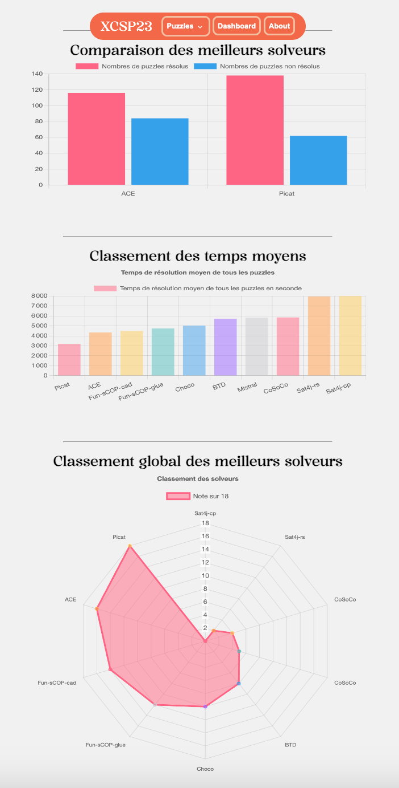
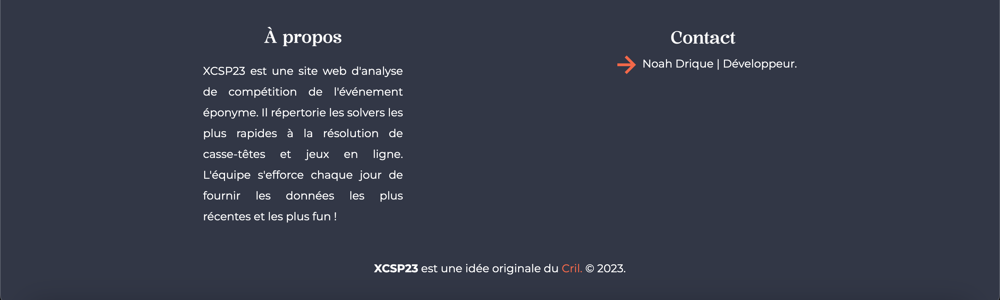

# XCSP23 - Noah Drique

L'équipe est composée uniquement de [Noah Drique](https://www.github.com/nwyux).

## Les problèmes rencontrés

| Probèmes     | Solutions                |
| :----------------- | :------------------------- |
| Données s'affichant plusieurs fois | Utilisation de la méthode Set |
| Récupération des données dans le JSON | Utilisation d'une URL directement |

## Visualisation proposée

Tout d'abord, les graphiques sont visualisables sur un site One Page qui répertorie les graphiques. Chacun analyse les différentes capacités des programmes à résoudre des puzzles plus ou moins complexes.

## Screenshots

